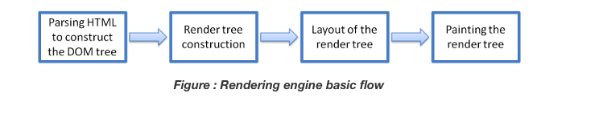

Exercise1.1:1. When a user enters an URL in the browser, how does the browser fetch the desired result ? Explain this with the below in mind and Demonstrate this by drawing a diagram for the same.(2-3hours)

a. What is the main functionality of the browser?

b. High Level Components of a browser.

c. Rendering engine and its use.

d. Parsers (HTML, CSS, etc)

e. Script Processors

f. Tree construction

g. Order of script processing

h. Layout and Painting

**ANSWER –**

**Enter the URL in the browser –** suppose we want to visit the website of Myntra. So we type myntra.com in the address bar of the browser. When we type the URL we basically want to reach the server where the website is hosted.

The browser will look for the IP address of the domain name in the DNS(Domain Name Server). The DNS checks at the following places for the IP address - Check Browser Cache, Check OS Cache, Router Cache, ISP(Internet Service Provider) Cache

#### The Browser initiates a TCP connection with the server, the browser sends an HTTP request to the server. The server handles the incoming request and sends an HTTP response.

#### 

#### The browser displays the HTML content.

#### 

All these steps happen each time we enter any URL. All these processes happen in the background and within milliseconds.

a) The main functions of web browser is to fetch or retrieve informative resources from World Wide Web to the client/ user on demand, translate those files received from web server and display those content to the user and allow the client /user to access all other relevant resources & information via hyperlinks.

When the user inputs any URL (uniform resource locator) in the web browser, the user is navigated to that website by the browser quickly. Let us have a look on its processing. When user type any URL, for example [https://msatechnosoft.in](https://msatechnosoft.in/), the prefix of the URL decide how to retrieve it. The URL prefixes that the web browser is not able to handle directly is sent to related application.

b) High Level Components of Browser – The below image shows the main components of a web browser:

1.  **The User Interface**: The user interface is the space where User interacts with the browser. It includes the address bar, back and next buttons, home button, refresh and stop, bookmark option, etc. Every other part, except the window where requested web page is displayed, comes under it.
2.  **The Browser Engine**: The browser engine works as a bridge between the User interface and the rendering engine. According to the inputs from various user interfaces, it queries and manipulates the rendering engine.
3.  **The Rendering Engine**: The rendering engine, as the name suggests is responsible for rendering the requested web page on the browser screen. The rendering engine interprets the HTML, XML documents and images that are formatted using CSS and generates the layout that is displayed in the User Interface. However, using plugins or extensions, it can display other types data also. Different browsers user different rendering engines:  
    \* Internet Explorer: Trident  
    \* Firefox & other Mozilla browsers: Gecko  
    \* Chrome & Opera 15+: Blink  
    \* Chrome (iPhone) & Safari: Webkit
4.  **Networking**: Component of the browser which retrieves the URLs using the common internet protocols of HTTP or FTP. The networking component handles all aspects of Internet communication and security. The network component may implement a cache of retrieved documents in order to reduce network traffic.
5.  **JavaScript Interpreter:** It is the component of the browser which interprets and executes the javascript code embedded in a website. The interpreted results are sent to the rendering engine for display. If the script is external then first the resource is fetched from the network. Parser keeps on hold until the script is executed.
6.  **UI Backend**: UI backend is used for drawing basic widgets like combo boxes and windows. This backend exposes a generic interface that is not platform specific. It underneath uses operating system user interface methods.
7.  **Data Persistence/Storage:** This is a persistence layer. Browsers support storage mechanisms such as localStorage, IndexedDB, WebSQL and FileSystem. It is a small database created on the local drive of the computer where the browser is installed. It manages user data such as cache, cookies, bookmarks and preferences.

#### c) Rendering Engine - Role of Rendering Engine

Once a user requests a particular document, the rendering engine starts fetching the content of the requested document. This is done via the networking layer. The rendering engine starts receiving the content of that specific document in chunks of 8 KBs from the networking layer. After this, the basic flow of the rendering engine begins.

The four basic steps include:

1.  The requested HTML page is parsed in chunks, including the external CSS files and in style elements, by the rendering engine. The HTML elements are then converted into DOM nodes to form a **“content tree” or “DOM tree.”**
2.  Simultaneously, the browser also creates a **render tree.** This tree includes both the styling information as well as the visual instructions that define the order in which the elements will be displayed. The render tree ensures that the content is displayed in the desired order.

    Further, the render tree goes through the **layout process.** When a render tree is created, the position or size values are not assigned. The entire process of calculating values for evaluating the desired position is called a layout process. In this process, every node is assigned the exact coordinates. This ensures that every node appears at an accurate position on the screen.

3.  The final step is to paint the screen, wherein the render tree is traversed, and the renderer’s **paint()** method is invoked, which paints each node on the screen using the UI backend layer.

e) Script processor –

The script processor executes Javascript code to process an event. The processor uses a pure Go implementation of ECMAScript 5.1 and has no external dependencies. This can be useful in situations where one of the other processors doesn’t provide the functionality you need to filter events.

The processor can be configured by embedding Javascript in your configuration file or by pointing the processor at external file(s).

processors:

\- script:

lang: javascript

source: \>

function process(event) {

event.Tag("js");

}

f) Tree Construction - To create a tree structure, we have to create a nested HTML list according to the following steps –

-   Create a root unordered list with class="root-tree" .
-   Also, create a span tag with class="tree" within list tag of root list.
-   Create child/sub unordered list with class="subtree" and create the required list.

File Name – index.php

\<!DOCTYPE html\>

**\<html\>**

**\<head\>**

**\<title\>**Tree Structure in JavScript**\</title\>**

**\<META** NAME="ROBOTS" CONTENT="NOINDEX, NOFOLLOW"**\>**

**\</head\>**

**\<body\>**

**\<ul** class="root-tree"**\>**

**\<li\>\<span** class="tree"**\>**Web Technology**\</span\>**

**\<ul** class="subtree"**\>**

**\<li\>**App Development**\</li\>**

**\<li\>**Web Development**\</li\>**

**\<li\>\<span** class="tree"**\>**Web Designing**\</span\>**

**\<ul** class="subtree"**\>**

**\<li\>**HTML**\</li\>**

**\<li\>**CSS**\</li\>**

**\<li\>\<span** class="tree"**\>**JavaScript**\</span\>**

**\<ul** class="subtree"**\>**

**\<li\>**JavaScript Intro**\</li\>**

**\<li\>**JavaScript String**\</li\>**

**\<li\>**JavaScript Array**\</li\>**

**\<li\>**JavaScript Object**\</li\>**

**\</ul\>**

**\</li\>**

**\</ul\>**

**\</li\>**

**\</ul\>**

**\</li\>**

**\</ul\>**

**\</body\>**

**\</html\>**

This code creates a static tree structure. It will be created togglable using javascript in the next step.

### 2. Design Tree Structure using CSS

To make a user-friendly & attractive tree structure, you will have to design it using CSS.File Name – style.css

**.subtree{**

list-style-type:square**}**

**.tree** **{**

cursor: pointer;

**}**

**.plus**,**.minus{**

display: flow-root;

position: relative;

right: 10px;**}**

**.subtree** **{**

display: none;

**}**

**.active** **{**

display: block;**}**

**.plus***::before* **{**

content: "+";

color: black;

display: inline-block;

margin-right: 6px;**}**

**.minus***::before* **{**

content: "-";

color: black;

display: inline-block;

margin-right: 6px;**}**

Don’t forget to include this CSS code in the file index.php

### 3. Toggle Tree Structure using JavaScript

To toggle tree structure, you will have to implement the following steps –

-   First of all, Access a class .tree using querySelectorAll() and assign to tree
-   Create a for loop and initialize i=0
-   Now, write all the next steps within the for loop
-   add a class plus to the parent list
-   Create an anonymous function with onclick and write the next steps within it
-   Active toggle in the subtree
-   And add a class minus to the parent list

File Name – custom.js

var tree= document.querySelectorAll**(**".tree"**)**;

**for** **(**var i = 0; i **\<** tree.length; i++**)** **{**

tree**[**i**]**.parentElement.classList.add**(**'plus'**)**;

tree**[**i**]**.onclick= **function()** **{**

this.parentElement.querySelector**(**".subtree"**)**.classList.toggle**(**"active"**)**;

this.parentElement.classList.toggle**(**'minus'**)**;

**}**;

**}**
